# 📝jpa_public
> 2022.12.20 ~ ing
- back-end
  - SpringBoot 2.7.6 ver
  - JDK 11.0.16 ver
  - gradle
  - h2 Database 1.4.200 ver
  - jpa
- front-end
  - thymeleaf 3.0.15 ver
  - jquery 3.5.1 ver
  - bootstrap 4.3.1 ver

---

### Description

처음엔 온라인 강의로 학습한 Spring Boot 와 JPA 내용들을 직접 코드로 
실현해보고자 MVC 패턴과 domain 설계 방식을 이용하여 간단한 게시판 만들기 프로젝트를 시작하게 되었습니다. 

로그인, 게시판, 댓글달기 정도의 기능을 구현해 가면서 프로젝트의 크기를 키워보고자 하는 욕심이 생겼고,
간단한 게시판 프로젝트와 접목시킬 여러가지 API를 검색해보다가 **NEWS API** 를 발견하게 되었습니다.

그날의 **Top Headline 뉴스**와 **검색을 통해 내가 원하는 뉴스를 찾아볼 수 있는** 기능이 있어, **NEWS API**를 활용하면
좀 더 재미있는 프로젝트가 탄생할 수 있을 거 같아 **NEWS 컨텐츠**까지 포함시키게 되었습니다.

지금까지 구현된 기능들로는
````
 - 로그인
 - 회원가입
 - 마이페이지 (My info, Bookmarked Board, My Article)
 - 게시글 작성
 - 게시글에 댓글 & 대댓글 달기
 - 원하는 게시글 북마크 하기
 - 원하는 뉴스기사 저장하기
````
등을 구현한 상태이며 

이후에는 `게시글 및 댓글 신고` 과 `관리자 권한` 등 다양한 기능들을 구현해 나갈 계획입니다.
프로젝트 구조와 구현된 기능들에 대한 설명은 **하단 Notion 페이지**에 자세히 설명해 놓았으니
확인부탁드립니다.


#### Notion Link

https://spiny-voyage-87c.notion.site/JPA_public-7828a026836941deac47e6fd0f3f4f05


[//]: # (<details>)

[//]: # (<summary><b>로그인 및 회원가입</b></summary>)

[//]: # (<div markdown="1">)

[//]: # ()
[//]: # (1. 로그인)

[//]: # ()
[//]: # (- 세션 적용하여 로그인 구현)

[//]: # (- 아이디와 비밀번호를 입력해서 로그인)

[//]: # (- 아이디가 없을경우 `회원가입` 페이지로 이동해서 회원가입 진행)

[//]: # (- `아이디` or `비밀번호` 가 다를경우 `“아이디 또는 비밀번호가 맞지 않습니다.”` 문구 표출)

[//]: # (- 아이디와 비밀번호 칸에 공백입력시 `“공백일 수 없습니다”` 문구 표출)

[//]: # (    <details>)

[//]: # (    <summary>로그인 에러 이미지</summary>)

[//]: # (    <div markdown="1">)

[//]: # (    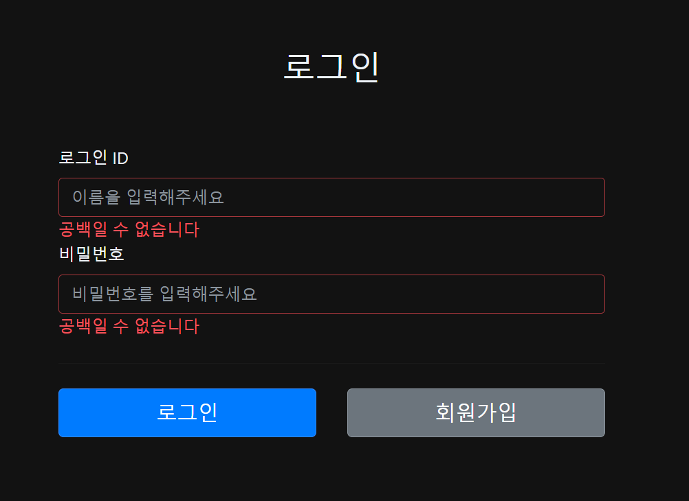)

[//]: # (    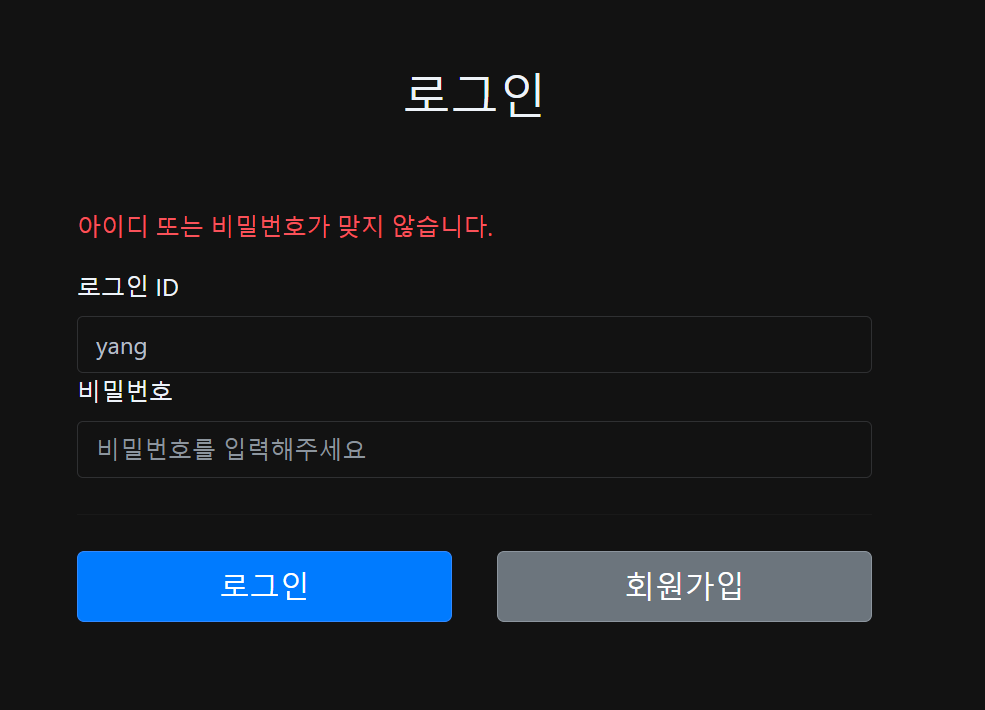)

[//]: # (    </div>)

[//]: # (    </details>)

[//]: # (  )
[//]: # (2. 회원가입)

[//]: # ()
[//]: # (- 아이디와 비밀번호를 입력후 `Submit` 버튼을 눌러 가입 진행)

[//]: # (- 가입이 완료되면 로그인 화면으로 이동)

[//]: # (- 중복된 아이디의 유저가 있으면 `"동일한 ID의 사용자가 존재합니다."` 문구 표출)

[//]: # (    <details>)

[//]: # (    <summary>회원가입 이미지</summary>)

[//]: # (    <div markdown="1">)

[//]: # (    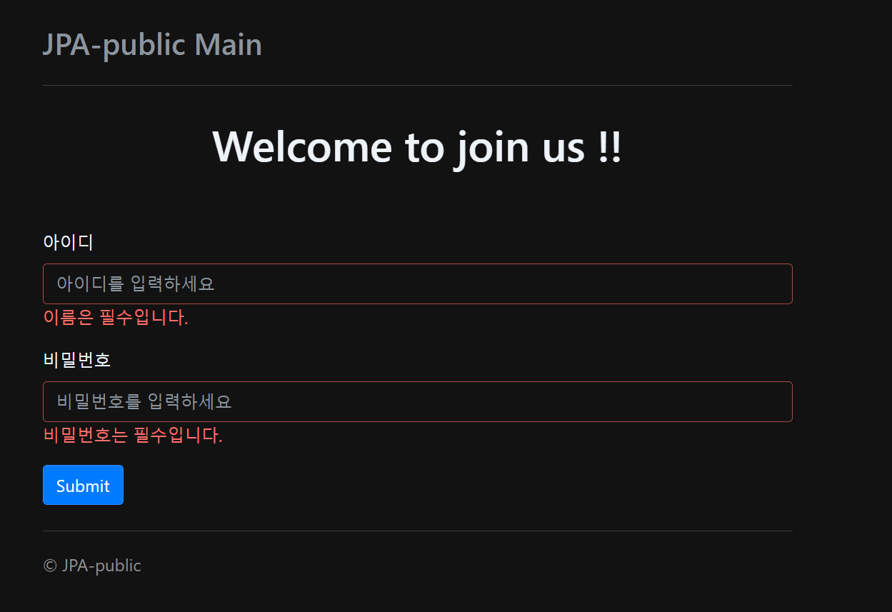)

[//]: # (    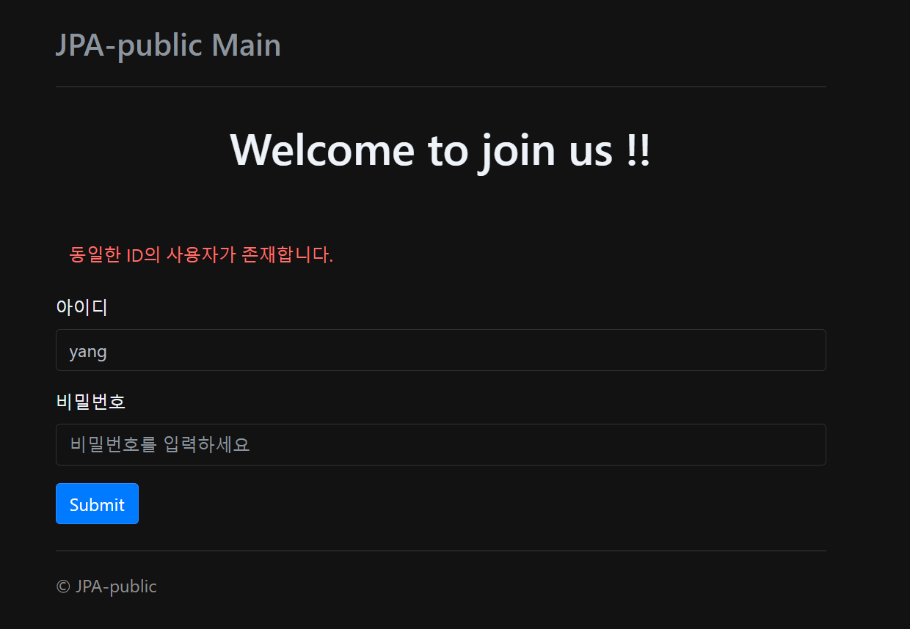)

[//]: # (    </div>)

[//]: # (    </details>)

[//]: # (</div>)

[//]: # (</details>)

[//]: # ()
[//]: # (<details>)

[//]: # (<summary><b>메인홈</b></summary>)

[//]: # (<div markdown="1">)

[//]: # ()
[//]: # (1. 메인홈)

[//]: # ()
[//]: # (- 로그인 완료시, 메인홈으로 이동)

[//]: # (- `로그아웃` 버튼과 `마이페이지`, `게시판 작성`, `게시판 목록`과 관련된 버튼이 있음)

[//]: # (    <details>)

[//]: # (    <summary>메인홈 이미지</summary>)

[//]: # (    <div markdown="1">)

[//]: # (    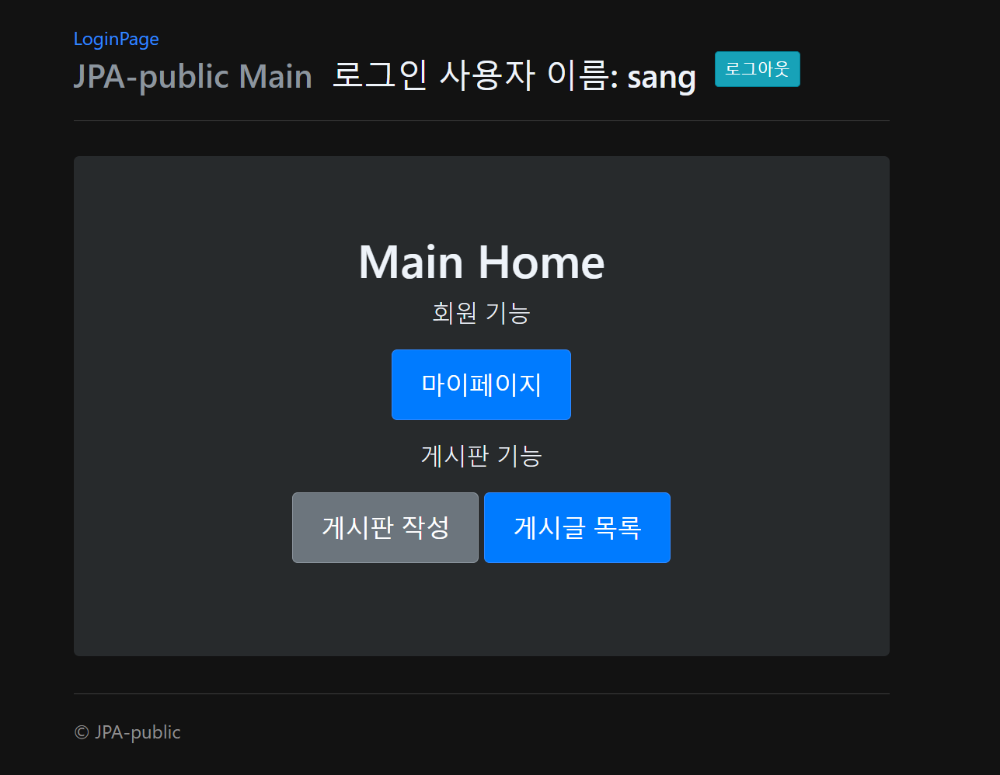)

[//]: # (    </div>)

[//]: # (    </details>)

[//]: # (</div>)

[//]: # (</details>)

[//]: # ()
[//]: # (<details>)

[//]: # (<summary><b>게시판</b></summary>)

[//]: # (<div markdown="1">)

[//]: # ()
[//]: # (1. 게시글작성)

[//]: # ()
[//]: # (- 메인 홈 화면에서 `게시판 작성` 버튼 클릭시 게시글 작성 화면으로 이동)

[//]: # (- 작성자는 현재 로그인중인 멤버의 세션값에서 가져와서 자동으로 세팅)

[//]: # (- 제목과 내용을 아무것도 입력 하지 않고 `저장하기` 클릭시)

[//]: # (  `”제목은 필수 입니다.”`  or `“내용을 입력해주세요.”` 문구 표출)

[//]: # (- 작성한 게시글이 정상적으로 DB에 저장되면 게시글목록 페이지로 이동)

[//]: # (    <details>)

[//]: # (    <summary>게시글작성 이미지</summary>)

[//]: # (    <div markdown="1">)

[//]: # (    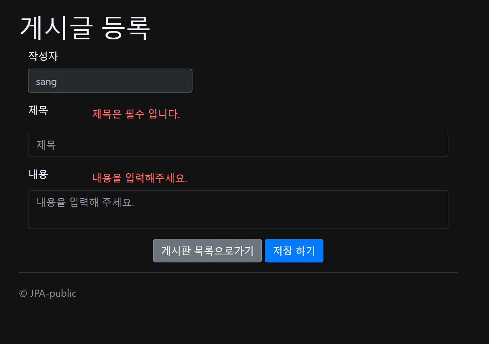)

[//]: # (    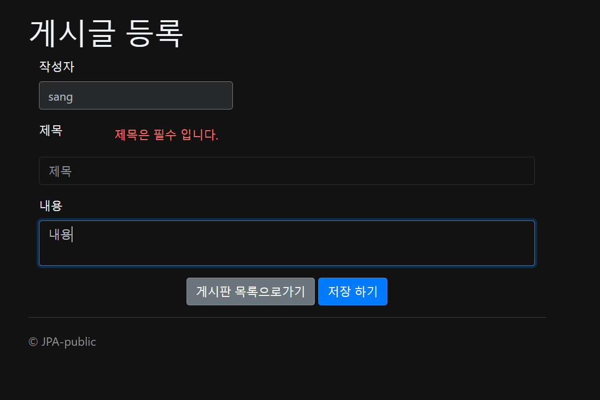)

[//]: # (    </div>)

[//]: # (    </details>)

[//]: # (2. 게시글목록)

[//]: # ()
[//]: # (- 메인 홈 화면에서 `게시글 목록` 버튼 클릭시 게시글 DB의 status 컬럼이 ***EXIST***인)

[//]: # (  게시글 확인 가능)

[//]: # (- 게시판 id를 오름차순으로 게시글 목록 정렬)

[//]: # (- 한번에 나타내는 게시글의 갯수는 10개로 지정, 10개가 넘어가는 경우 페이지를 나눔)

[//]: # (- 우측 하단 `글쓰기` 버튼으로 새로운 게시글 작성 가능)

[//]: # (- 게시글이 없을 경우 `“게시물이 존재하지 않습니다.”` 문구 표출 및)

[//]: # (  하단, `메인홈으로` 버튼 클릭하여 메인홈으로 이동)

[//]: # (    <details>)

[//]: # (    <summary>게시글목록 이미지</summary>)

[//]: # (    <div markdown="1">)

[//]: # (    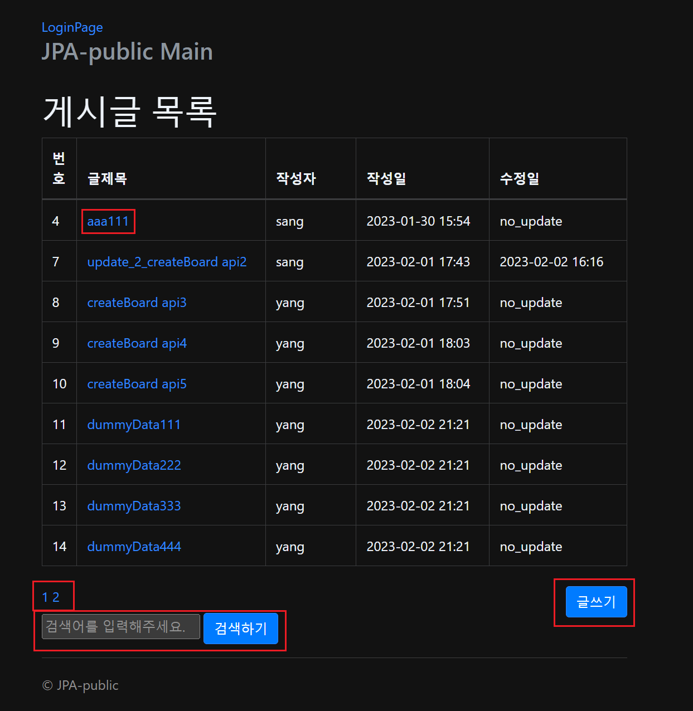)

[//]: # (    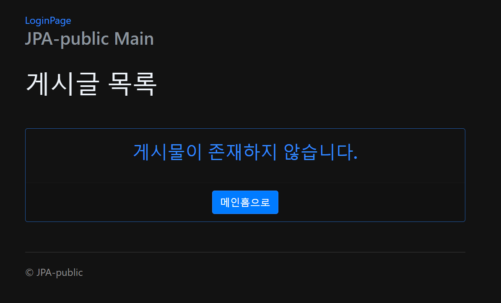)

[//]: # (    </div>)

[//]: # (    </details>)

[//]: # ()
[//]: # (3. 게시글검색)

[//]: # ()
[//]: # (- `검색하기` 를 통해 게시글 제목을 검색하여 특정 게시물만 검색 가능)

[//]: # (- 검색한 게시물이 10개가 넘어갈 경우 페이징 처리)

[//]: # (- 게시글이 없을 경우 `“게시물이 존재하지 않습니다.”` 문구 표출 및)

[//]: # (  하단, `뒤로가기` 버튼 클릭하여 게시물 목록페이지로 돌아가기 가능)

[//]: # (    <details>)

[//]: # (    <summary>게시글검색 이미지</summary>)

[//]: # (    <div markdown="1">)

[//]: # (    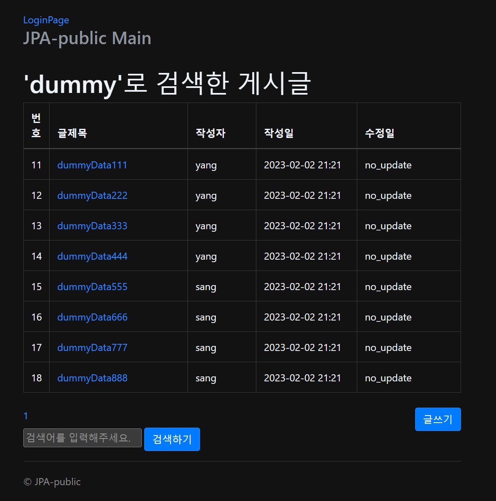)

[//]: # (    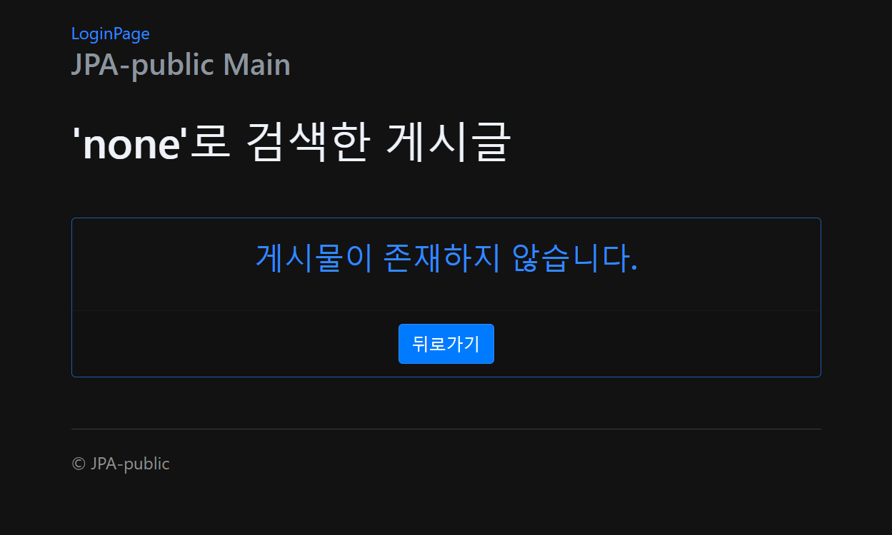)

[//]: # (    </div>)

[//]: # (    </details>)

[//]: # ()
[//]: # (4. 게시글수정)

[//]: # ()
[//]: # (- 수정하고 싶은 게시글 열람하여 제목 및 내용을 수정한 후 `수정하기` 버튼을 눌러 수정)

[//]: # (- 수정이 완료되면 게시글목록 페이지로 이동 및 게시글을 수정한시간 확인 가능)

[//]: # (- 게시글은 모든 사용자가 열람 가능)

[//]: # (- 작성자와 현재로그인한 사용자가 같을 경우만 게시글 수정가능)

[//]: # (    <details>)

[//]: # (    <summary>게시글수정 이미지</summary>)

[//]: # (    <div markdown="1">)

[//]: # (    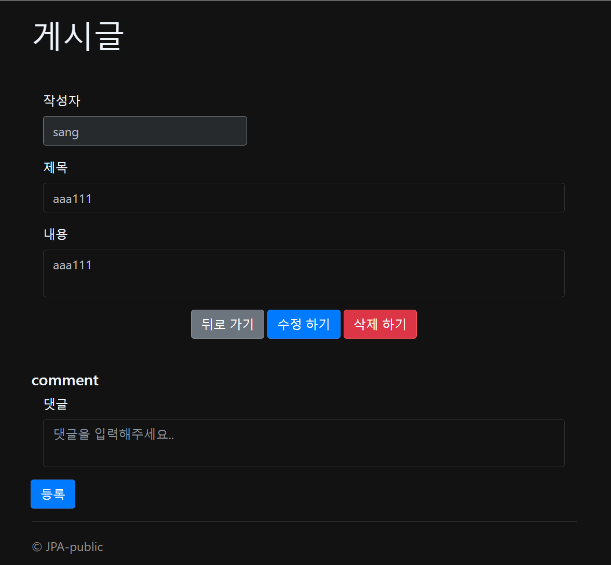)

[//]: # (    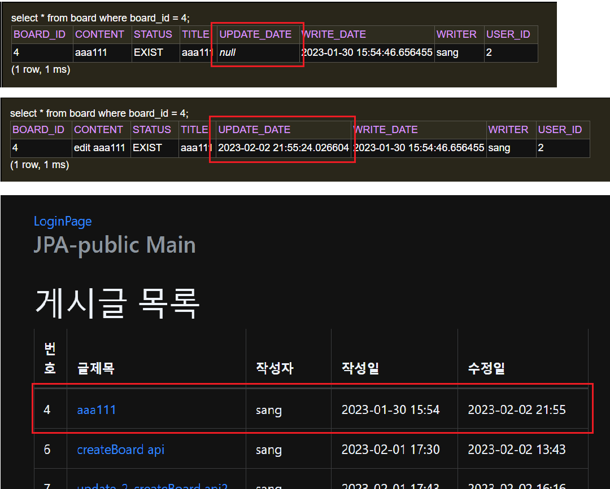)

[//]: # (    </div>)

[//]: # (    </details>)

[//]: # ()
[//]: # (5. 게시글삭제)

[//]: # ()
[//]: # (- 클릭한 게시글 하단에 `삭제하기` 버튼 클릭시 해당 게시글 data의 status 컬럼이)

[//]: # (  ***EXIST*** 에서 ***DELETED*** 로 변경)

[//]: # (- 삭제가 완료되면 게시글목록 페이지로 이동)

[//]: # (    <details>)

[//]: # (    <summary>게시글삭제 이미지</summary>)

[//]: # (    <div markdown="1">)

[//]: # (    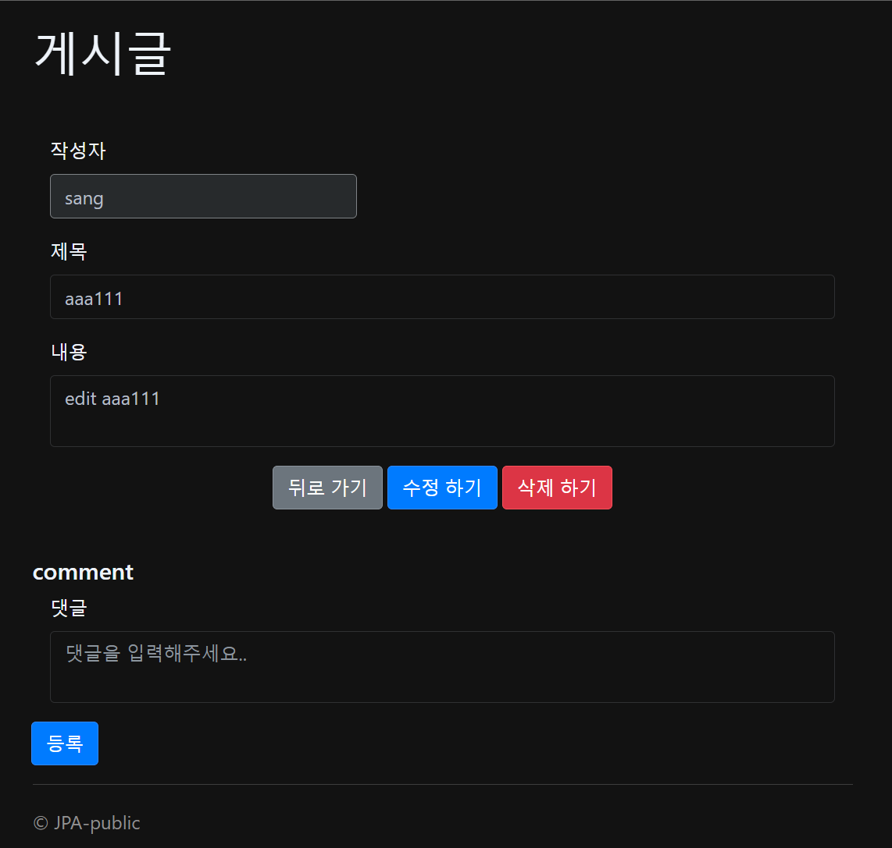)

[//]: # (    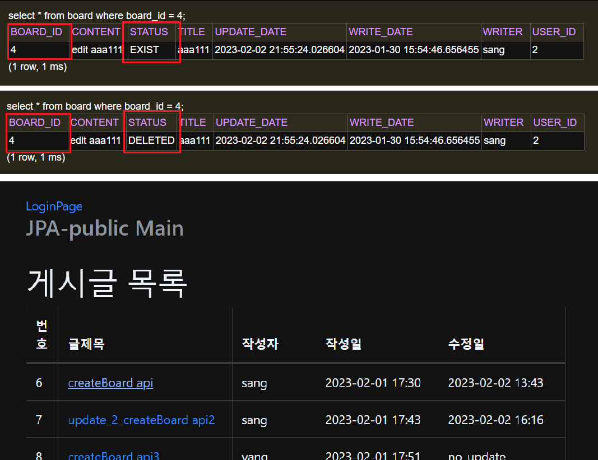)

[//]: # (    </div>)

[//]: # (    </details>)

[//]: # (</div>)

[//]: # (</details>)

[//]: # ()
[//]: # (<details>)

[//]: # (<summary><b>댓글</b></summary>)

[//]: # (<div markdown="1">)

[//]: # ()
[//]: # (</div>)

[//]: # (</details>)